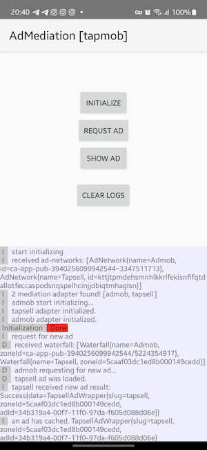

# AdMediation SDK

This project is aims to implement an **Ad Mediation SDK** capable of managing multiple ad networks
dynamically based on configurations fetched from a server.

### Modules

- `admediation-core`
    - Contains the core classes and serves as the SDK initializer.
  - Handles the main logic for managing ad networks and configurations.
  - Parts:
      - **Network**: Uses Ktor for networking, but it can be replaced with any other tools.

      - **Adapters**: These are plugins that can be plug by developer. Currently `admob` and
        `tapsell` are supporting.

      - **Cache**: A simple pool is used to keep unwatched ads and also manage their expiration
        time.

      - **Models**: Includes all models that is used in core module

      - **Logger**: Logger object is inspired from [Timber](https://github.com/JakeWharton/timber)
        and [Sentry](https://github.com/getsentry/sentry-java) that is pluggable and user can add
        its own logger object and collect debugging logger.

      - **DI**: An isolated context of `Koin` does service-locating/injection in this project.

      - **AdMediation**: Entry point of the SDK and provide multiple method.

- `admediation-admob`
    - Responsible for integrating
      the [AdMob](https://developers.google.com/admob/android/quick-start) dependency and providing
      utility functions for AdMob
      integration.
    - This module has no standalone functionality and works exclusively in conjunction with
      `admediation-core`.

- `admediation-tapsell`
    - Responsible for integrating the [Tapsell](https://docs.tapsell.ir/tapsell-sdk/android/main/)
      dependency and providing utility functions for Tapsell integration.
  - This module has no standalone functionality and works exclusively in conjunction with
    `admediation-core`.

- `example`
    - A mixed java and kotlin sample that is demonstrating how to integrate and use the AdMediation
      SDK.
        * MainActivity.java (default)
      * MainKotlinActivity.kt (change via AndroidManifest)

    - Two product flavors provided:
        - `tapsell` (Tapsell integration)
        - `tapmob`  (Tapsell integration + Admob integration)

### Roadmap

- [X] Support AdMob
- [X] Support Tapsell SDK
- [X] Writing unit tests **(WIP)**
- [X] Compatible with Java projects
- [ ] Apply restriction in multi-thread environments
- [ ] Remove reflections
- [ ] ...

### Known issues

- [ ] **Runtime Exceptions:** Some runtime exceptions are causing the application to crash. These
  need to be identified and handled gracefully.
- [ ] **Non Google Services** devices is not considered yet. And may cause exception or have
  unexpected behavior.
- [ ] **SDK State Tracking:** Keep track of sequence of operations that user can do, or restrict him
  from doing something multiple time.
- [ ] **Proguard Rules:** May some unexpected errors occurs in minification.
- [ ] **TODO**s and **FIXME**s
- [ ] **Report new issues via [issues](https://github.com/beigirad/AdMediation/issues) section**